# Omi for Windows

A Windows desktop port of the Omi macOS app (`desktop/Desktop`), built for the
Omi Summer "Track 1: Windows App" challenge. It looks like the Swift app, talks to
the same production backends, and brings over as many features as a Windows build
can reasonably support.

> Stack: Electron 38 + TypeScript + React 18 (electron-vite). No backend changes —
> it uses the same `api.omi.me` Python backend and the same Cloud Run desktop
> backend the Mac app uses, with the same Firebase auth.

## Screenshots

| | |
|---|---|
| Dashboard (score gauge + widgets) | 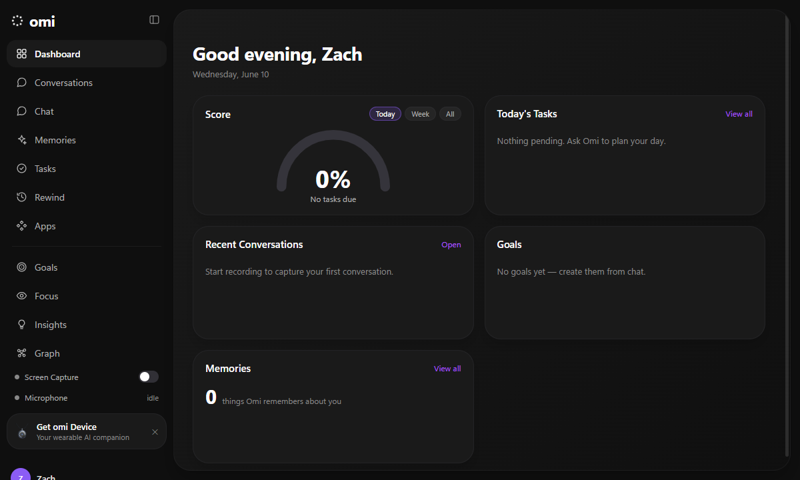 |
| Conversations + live recording | 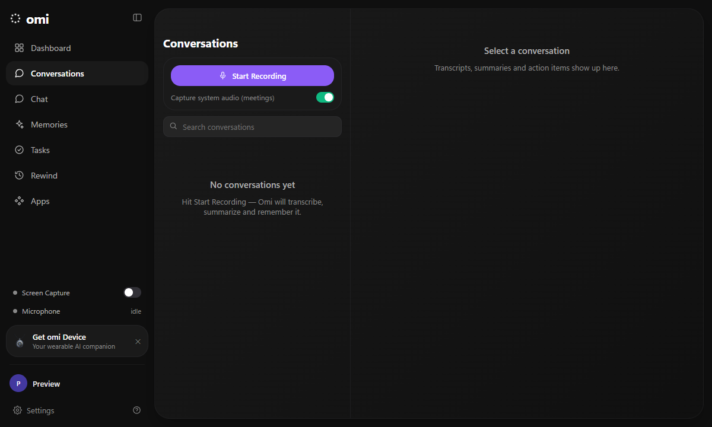 |
| Goals | 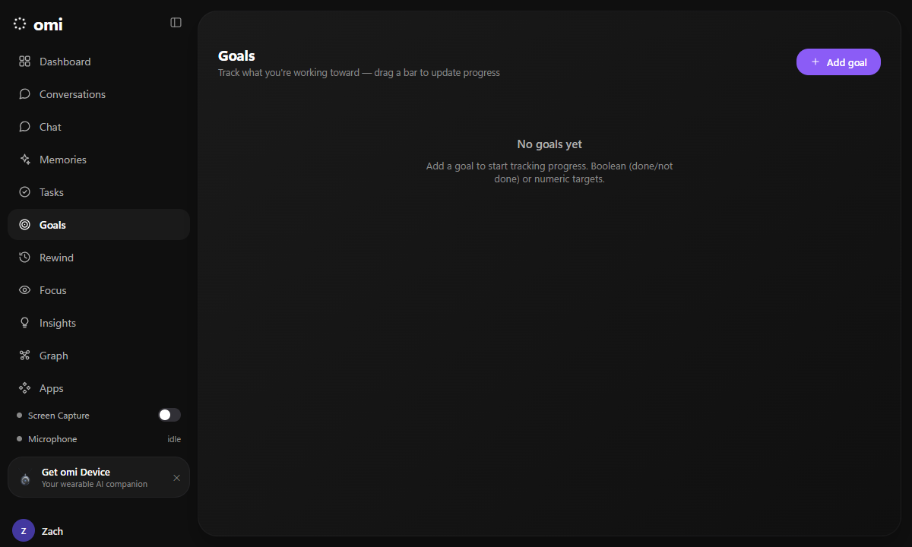 |
| Focus | 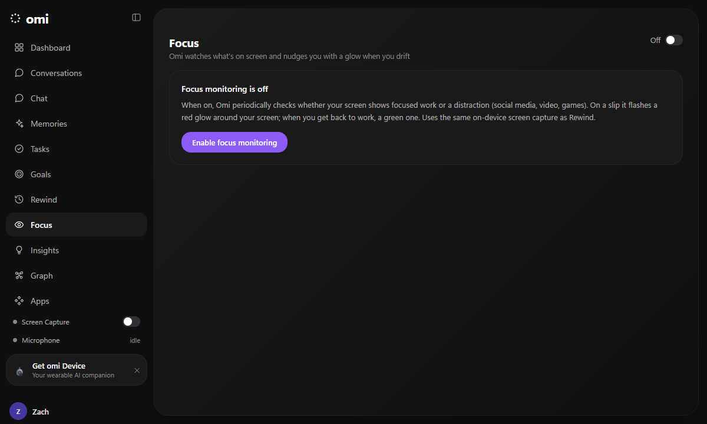 |
| Memory graph | 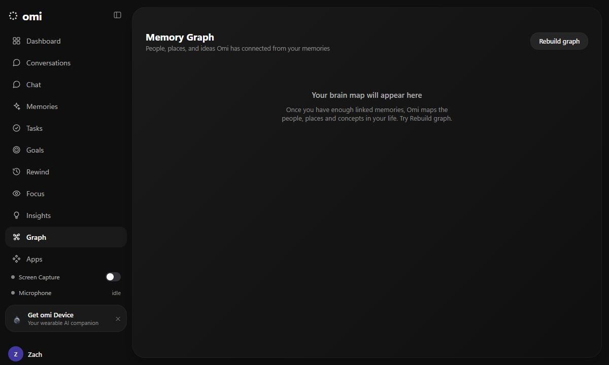 |
| Memories | 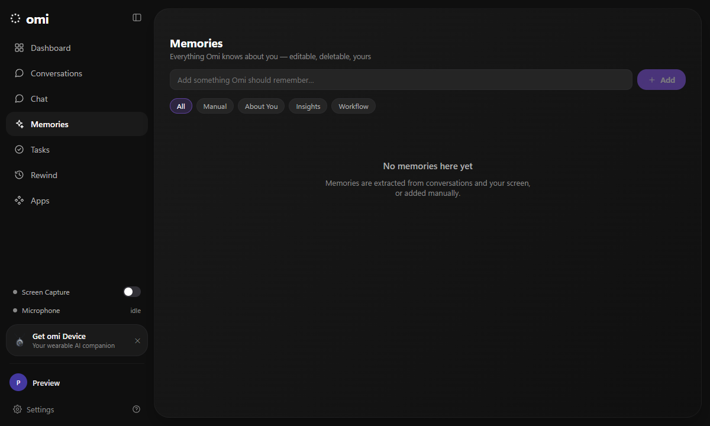 |
| Rewind | 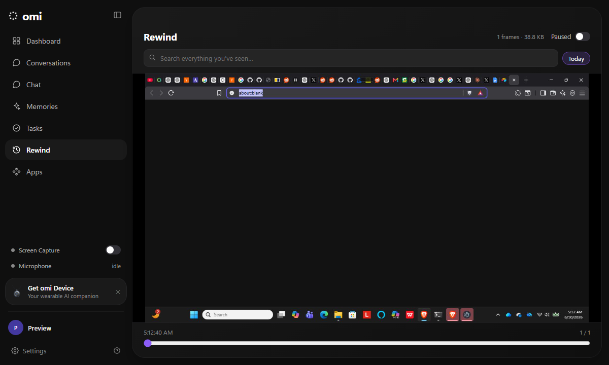 |
| Insights (proactive) | 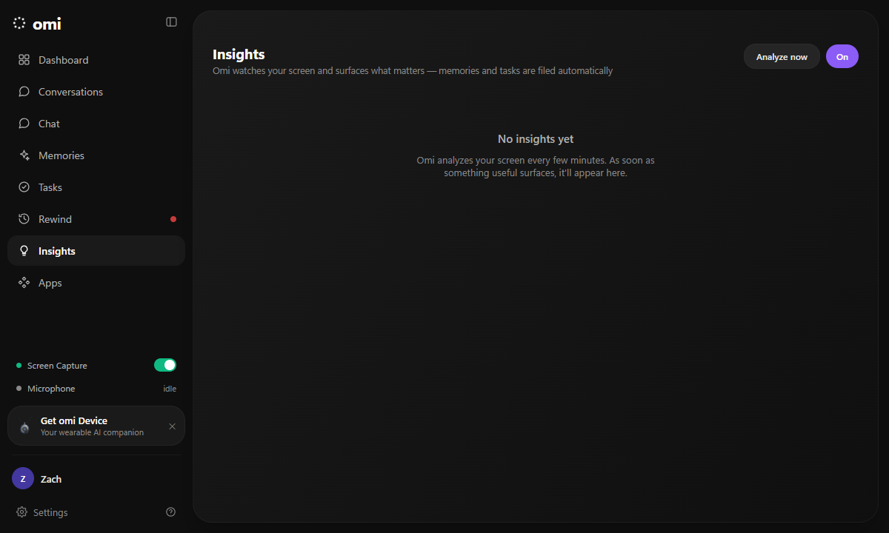 |
| Settings | 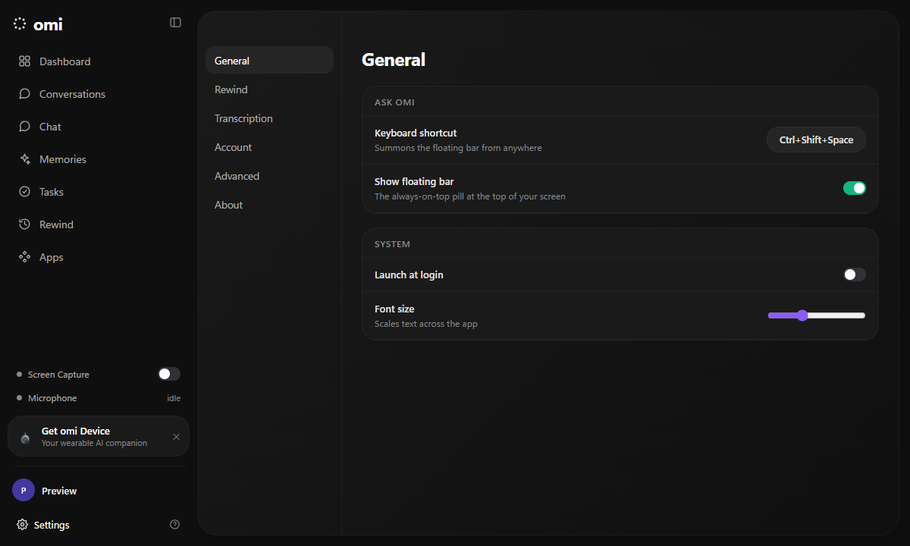 |
| Sign-in | 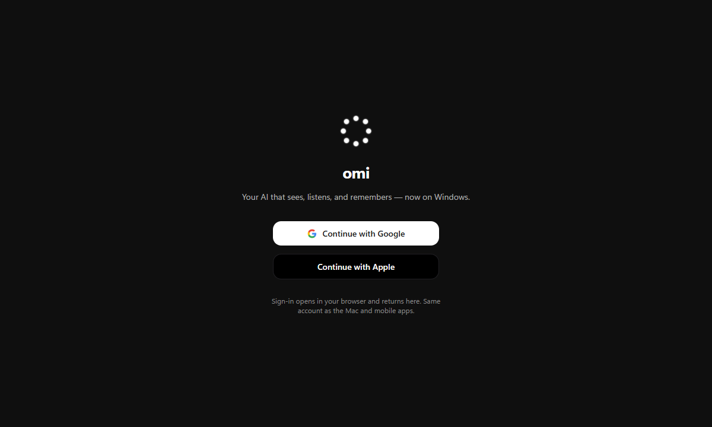 |

Floating "Ask omi" bar (collapsed pill → hover bar → ask input):

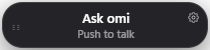
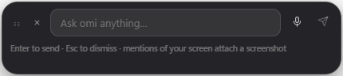

## What works

Everything below is wired to the same endpoints as the Mac app.

- **Sign in** with Google or Apple — system-browser OAuth via `/v1/auth/authorize`,
  custom-token exchange, Firebase ID token + refresh. Returns to the app through the
  `omi-computer://` protocol (same scheme the Mac app registers).
- **Floating control bar** — frameless, always-on-top, draggable, position persisted.
  Collapsed pill → hover bar ("Ask omi" / "Push to talk") → ask input → streaming AI
  conversation. Global hotkey (`Ctrl+Shift+Space`, configurable) toggles it from
  anywhere.
- **Chat** with streaming responses from `/v2/chat/completions` (the OpenAI-compatible
  Anthropic proxy, `claude-sonnet-4-6`), markdown rendering, session history.
- **"What do you see?"** — attaches a screenshot (and recent screen OCR text) to the
  chat so Omi can answer about your screen.
- **Push-to-talk voice** — mic → `/v2/voice-message/transcribe-stream`, transcript
  drops into the ask box.
- **Live conversations** — mic + system audio (WASAPI loopback) → `/v4/listen`
  (16 kHz mono PCM16), live speaker-labelled transcript, conversation saved on stop.
- **Conversations** — list, search, detail (summary, action items, transcript),
  star, rename, delete.
- **Memories** — list with the Manual / About You / Insights / Workflow filters, add,
  edit, delete (`/v3/memories`).
- **Tasks** — overdue / today / upcoming / no-due grouping, complete, add, delete
  (`/v1/action-items`).
- **Dashboard** — greeting, today's tasks, recent conversations, goals, memory count.
- **Rewind (Windows-native)** — captures the screen every 3s, dedupes with a 9×8
  dHash (≤5-bit Hamming = same screen), OCRs each frame with the built-in
  **Windows.Media.Ocr** engine, indexes the text in SQLite FTS5, and gives you a
  searchable timeline. Everything stays local.
- **Proactive assistant** — when enabled, periodically reads recent screen OCR text
  (the same on-device capture as Rewind), asks the LLM to extract durable memories,
  action items, and at most one useful nudge; memories/tasks sync to your account,
  and nudges appear on the **Insights** page and as a floating-bar notification card.
- **Apps** — MCP key creation (`/v1/mcp/keys`) to connect Omi memories to Claude /
  ChatGPT, plus links to mobile, Discord, marketplace.
- **Settings** — General (hotkey, floating bar, launch-at-login, font scale), Rewind
  (capture interval, retention, storage), Transcription (language), Account, Advanced
  (bring-your-own-keys via `X-BYOK-*` headers, backend URL overrides), About.
- **Tray** — mirrors the macOS menu-bar item (show/hide bar, screen capture toggle,
  open, settings, rewind, check for updates, quit). Tray-resident: closing the main
  window keeps Omi running.

## Parity with the macOS app

| macOS feature | Windows status | Notes |
|---|---|---|
| Google / Apple sign-in | ✅ | same backend OAuth + Firebase custom token |
| Floating control bar + states | ✅ | NSPanel → frameless always-on-top BrowserWindow |
| Global Ask-Omi hotkey | ✅ | Carbon hotkey → Electron `globalShortcut` |
| Streaming chat + sessions + rating | ✅ | `/v2/chat/completions` SSE; multi-session sidebar, history, thumbs up/down |
| Screenshot context | ✅ | ScreenCaptureKit → `desktopCapturer` |
| Push-to-talk + realtime voice | ✅ | transcribe-stream PTT + RealtimeOmni relay (Gemini/OpenAI) live voice |
| Live conversation capture + live notes | ✅ | mic + WASAPI loopback → `/v4/listen`; short AI notes during recording |
| Conversations (star, rename, share, speaker naming) | ✅ | same REST; public-link share; click-to-name speakers |
| Memories / Tasks (staged, due, indent) / Goals / Dashboard score | ✅ | same REST endpoints; semicircle score gauge; AI-staged tasks |
| Rewind (capture + OCR + search) | ✅ | `desktopCapturer` + Windows.Media.Ocr; GRDB FTS5 → better-sqlite3 FTS5 |
| Proactive assistant (memories/tasks/insights) | ✅ | screen OCR → LLM extraction → `/v3/memories` + `/v1/action-items` + insights in the floating bar |
| Focus assistant + screen-edge glow | ✅ | focused/distracted detection; green/red glow overlay (GlowBorderView params) |
| Knowledge / Memory graph | ✅ | `/v1/knowledge-graph`; 2D force-directed (Mac is 3D SceneKit) |
| Menu-bar / tray item | ✅ | NSStatusBar → Electron Tray |
| Auto-update | ✅ | Sparkle → electron-updater (GitHub releases feed) |
| BYOK free plan | ✅ | enroll 4 keys via `/v1/users/me/byok-active` to bypass the paywall |
| TTS spoken replies | ✅ | `/v1/tts/synthesize`, voice picker |
| File indexing / X import | ◑ | basic folder-scan → seed memory; X import links to omi.me |
| Design system (colors, radii, layout) | ✅ | tokens ported 1:1 from `Sources/Theme`; sidebar order matches Mac |
| Conversation folders / merge | ◑ | share done; folders + merge deferred |
| Onboarding flow | ◑ | sign-in screen covers first run; multi-step onboarding deferred |
| BLE pendant / Agent VMs | ❌ | out of scope (CoreBluetooth / cloud VM provisioning) |

## Architecture

```
src/
  main/            Electron main process (Node)
    index.ts         lifecycle, single instance, omi-computer:// protocol routing
    auth.ts          OAuth + Firebase token store (safeStorage) + refresh
    apiProxy.ts      all HTTP/SSE through main (Bearer + X-BYOK headers, 401 retry)
    transcription.ts WebSocket bridge to /v4/listen and transcribe-stream
    capture.ts       desktopCapturer screenshots + WASAPI loopback handler
    windows.ts       main window + floating bar window geometry
    tray.ts          tray menu (mirrors the macOS status item)
    shortcuts.ts     global Ask-Omi hotkey
    settings.ts      JSON settings store
    rewind/          capturer (3s loop) · dhash · ocr (PS sidecar) · store (SQLite FTS5)
  preload/         contextBridge → window.omi
  renderer/
    main-entry/      main window: App, Sidebar, SignInView, pages/*
    floating-entry/  floating bar
    stores/          zustand stores (auth, settings, conversations, memories, tasks, chat)
    api/             typed client + streaming chat
    theme.css        design tokens from Sources/Theme
  shared/          types shared across processes
resources/
  ocr-worker.ps1   persistent Windows.Media.Ocr sidecar
```

The macOS Rust desktop backend (`desktop/Backend-Rust`) is unchanged and used as-is
(production Cloud Run). No server code was modified for this port.

## Build & run

Requires Node 20+ and Windows 10/11.

```powershell
cd desktop/Windows
npm install
npm run dev        # hot-reload dev
npm run dist       # NSIS installer + portable .exe in dist/
```

`npm run dist` produces `dist/Omi Setup <version>.exe` (installer) and
`dist/Omi-<version>-portable.exe` (no-install).

### Environment overrides

| Var | Purpose |
|---|---|
| `OMI_PYTHON_API_URL` | override the Python backend (default `https://api.omi.me/`) |
| `OMI_DESKTOP_API_URL` | override the Rust desktop backend |
| `OMI_DEBUG_PORT` | expose Chrome DevTools Protocol for UI automation |
| `OMI_FAKE_AUTH=1` | dev: render the signed-in UI without a real login |

Backend URLs and BYOK keys can also be set in Settings → Advanced.

## Notes & limitations

- **Auto-update** uses Sparkle on macOS; not ported. Distribute via GitHub releases.
- **Rewind screen capture** uses the DXGI desktop-duplication path; on locked or pure
  RDP sessions Windows blocks it (works on a normal interactive desktop). The OCR
  (Windows.Media.Ocr) and FTS5 search pipeline are independent of that.
- **Code signing** is not configured; the installer is unsigned (SmartScreen will warn
  until signed, same as any unsigned Windows app).
